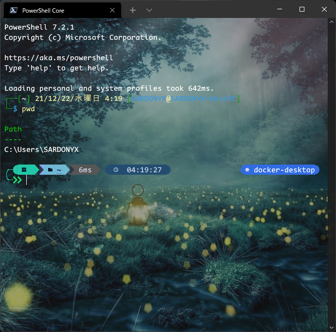
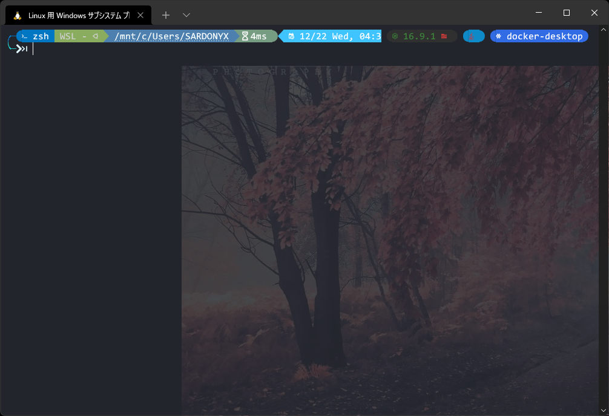

# dotfiles

[English](https://github.com/SARDONYX-sard/dotfiles) | 日本語

<p align="center">
  
  
</p>

- プロンプトの背景画像は付いてきません。
- ファイル単体での動作は一応確認していますが、統合テストは行っていないので、動作保証はいたしかねます。

## 目次

- [dotfiles](#dotfiles)
  - [目次](#目次)
  - [作者の動作環境](#作者の動作環境)
  - [インストール方法](#インストール方法)
    - [windows](#windows)
    - [GNU/Linux](#gnulinux)
  - [進捗状況](#進捗状況)
  - [注意'!'](#注意)
  - [手動でやらなければならないこと](#手動でやらなければならないこと)
    - [Windows-Terminal](#windows-terminal)
    - [.gitconfig](#gitconfig)
  - [動作内容](#動作内容)
  - [参考サイト](#参考サイト)
  - [ライセンス](#ライセンス)

## 作者の動作環境

- Windows11 Home
- WSL(Ubuntu)

## インストール方法

### windows

以下のコマンドを実行します。

```powershell
Invoke-Expression (New-Object System.Net.WebClient).DownloadString('https://raw.githubusercontent.com/SARDONYX-sard/dotfiles/main/install-win.ps1')
```

### GNU/Linux

WSLまたはLinux上で可能です。それぞれの実行挙動は以下の通りです。

Linux(WSLではない): linux内の$HOMEにdotfilesが置かれ、そこを中心としてシンボリックリンクを貼ります。

WSL: Windows側にdotfilesを置き、そこからシンボリックリンクをWSLに繋ぎます。

- Linux(WSLではない)の場合

以下のコマンドを実行します。

```bash
git clone https://github.com/SARDONYX-sard/dotfiles.git $HOME/dotfiles

cd ~/dotfiles
sudo bash "install-wsl.sh"
```

- WSL(Windows Subsystem for Linux)

1.PowerShellで以下のコマンドを実行します。(先にWindowsのdotfiles設定を実行している場合は不要)

```powershell
git clone https://github.com/SARDONYX-sard/dotfiles.git $HOME/dotfiles
```

2.WSLで以下のコマンドを実行します。

USERNAME問題についての参照URL:
[reddit](https://www.reddit.com/r/bashonubuntuonwindows/comments/8dhhrr/is_it_possible_to_get_the_windows_username_from/)

```bash
export USERNAME=`cmd.exe /c echo %username%`
cd /mnt/c/Users/${USERNAME}/dotfiles
sudo bash "./install-wsl.sh"
```

## 進捗状況

- 完成箇所

  - Windows settings
  - Linux settings

- 未完成箇所

  - 細かなバグ修正
  - 再現性の未確認(とくにWSL)
  - テストコードの追加

## 注意'!'

- これは私の開発環境のセットアップリポジトリです。 あなたが何をしているのか分かっていないのであれば、むやみにこのコードを実行しないでください。
  安易に実行すると、現在のあなたの開発環境が私の開発環境の設定に上書きされてしまいます。

- いくつかの設定は、日本語になっており、英語話者向けではない可能性があります。

- このプロジェクトは[こちら](https://github.com/LumaKernel/dotfiles)のdotfilesプロジェクトを参考にしています。
  彼に多大な感謝を…

## 手動でやらなければならないこと

- `Hard coded`とコメントが書かれたユーザー名の書き換え。(エディターの検索機能を使ってください)
- ただし現状`scoop`のパスから`windows`のユーザー名を割り出しているため`scoop`のパスがWSLでも認識できる状態ならほとんど書き換える必要がありません。

### Windows-Terminal

- windows-terminalの設定ファイルは自動生成のため、あなたの環境に適していません。ユーザー名、その他をあなたのPCに合わせる必要があります。

### .gitconfig

- 少なくともGit configのユーザ名とメールアドレスは、書き換えなければなりません。

ターミナル内で以下のコマンドを実行することで登録できます。

```bash
git config --global user.name "ユーザ名"
git config --global user.email "メールアドレス"
```

## 動作内容

下記をご覧ください。

[windowsフロー](./windows-flow.md)

[linuxフロー](./linux-flow.md)

## 参考サイト

- <https://github.com/LumaKernel/dotfiles>

- [Everything you wanted to know about hashtables](https://docs.microsoft.com/ja-jp/powershell/scripting/learn/deep-dives/everything-about-hashtable?view=powershell-7.2)

- [Optimizing your $Profile](https://devblogs.microsoft.com/powershell/optimizing-your-profile/)

## ライセンス

Unlicense
