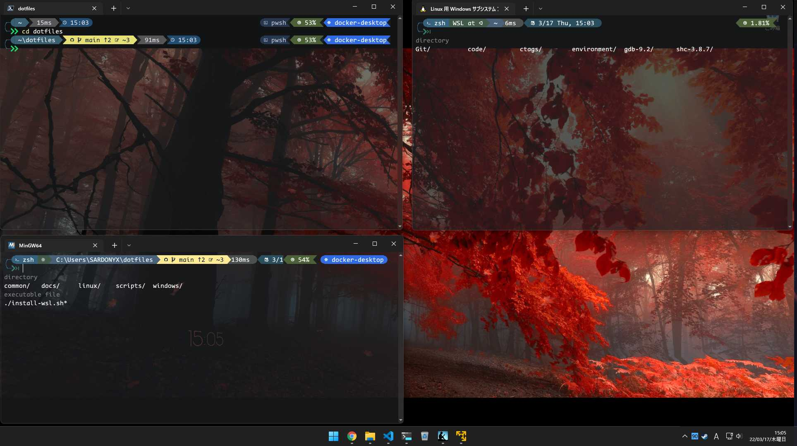

# dotfiles

English | [日本語](./docs/i18n/jp/readme.md)

## Important

**This dotfiles is optimized for private use and is not recommended for direct**
**use.**

**It is strongly recommended to use
[`Use this template`](https://github.com/SARDONYX-sard/dotfiles/generate).**

<p align="center">
  
</p>

- It does not come with a background image for the prompt.
- We have confirmed that the files work by themselves, but we have not tested
  the integration, so we cannot guarantee that they work.

## Table of Contents

- [dotfiles](#dotfiles)
  - [Important](#important)
  - [Table of Contents](#table-of-contents)
  - [Feature](#feature)
  - [Author's operating environment](#authors-operating-environment)
  - [How to install](#how-to-install)
    - [Windows](#windows)
    - [Linux](#linux)
    - [Docker](#docker)
  - [Progress](#progress)
  - [Note!](#note)
  - [Things you have to do manually](#things-you-have-to-do-manually)
    - [Windows-Terminal](#windows-terminal)
    - [.gitconfig](#gitconfig)
  - [How it works(Too old..)](#how-it-workstoo-old)
  - [Reference site](#reference-site)
  - [License](#license)

## Feature

[windows feature](./docs/i18n/en/windows-feature.md)

## Author's operating environment

- Windows11 Home
- WSL(Ubuntu/ArchLinux)

## How to install

### Windows

Select either command.

- **Recommended command**(The development language is put in manually.)

```powershell
$env:DOTFILES_INSTALL_MODE = 'lightweight';Invoke-Expression (New-Object System.Net.WebClient).DownloadString('https://raw.githubusercontent.com/SARDONYX-sard/dotfiles/main/install-win.ps1')
```

- Full size mode

```powershell
Invoke-Expression (New-Object System.Net.WebClient).DownloadString('https://raw.githubusercontent.com/SARDONYX-sard/dotfiles/main/install-win.ps1')
```

In case of an error, please execute the following command first.

```powershell
Set-ExecutionPolicy RemoteSigned
```

---

### Linux

Select either command.

- **Recommended command**(The development language is put in manually.)

```bash
((command -v curl) >/dev/null 2>&1 && curl -sSfL https://raw.githubusercontent.com/SARDONYX-sard/dotfiles/main/install-wsl.sh -o "/tmp/install-wsl.sh") ||
 ((command -v wget) >/dev/null 2>&1 && wget -P /tmp/ https://raw.githubusercontent.com/SARDONYX-sard/dotfiles/main/install-wsl.sh) && bash /tmp/install-wsl.sh --light --fish
```

- Full size mode

```bash
((command -v curl) >/dev/null 2>&1 && curl -sSfL https://raw.githubusercontent.com/SARDONYX-sard/dotfiles/main/install-wsl.sh -o "/tmp/install-wsl.sh") ||
 ((command -v wget) >/dev/null 2>&1 && wget -P /tmp/ https://raw.githubusercontent.com/SARDONYX-sard/dotfiles/main/install-wsl.sh) && bash /tmp/install-wsl.sh

# Options
# --zsh: Change default shell to zsh
# --fish: Install fish shell plugin
# --light: Lightweight mode (does not automatically include the development language)
```

### Docker

```bash
docker-compose up
```

## Progress

- Completed

  - Windows settings
  - Linux settings

- Incomplete

  - Minor bug fixes
  - Unchecked reproducibility (especially WSL)
  - Add test code

## <font color=yellow>Note!</font>

- This is the setup repository for my development environment. If you do not
  know what you are doing, do not run this code unnecessarily. If you run it
  easily, your current development environment will be overwritten by my
  development environment settings.

- Some settings are in Japanese and may not be suitable for English speakers.

- This project is based on the dotfiles project from
  [here](https://github.com/LumaKernel/dotfiles). A huge thanks to him...

## Things you have to do manually

- Rewrite the user name with `Hard coded` and comments. (Please use the search
  function of the editor).

- (Use the search function of the editor.) However, since the path of `scoop` is
  currently used to find the user name of `windows`, if the path of `scoop` can
  be recognized by WSL, there is almost no need to rewrite it.

### Windows-Terminal

- The windows-terminal configuration file is automatically generated and is not
  suitable for your environment. You will need to adapt the user name and other
  settings to your PC.

### .gitconfig

- At least you have to rewrite the Git config username and email address. You
  can register by running the following command in a terminal.

```bash
git config --global user.name "Your name"
git config --global user.email "Your email address"
```

## How it works(Too old..)

See below.

[windows flow](./docs/i18n/en/windows-flow.md)

[linux-flow](./docs/i18n/en/linux-flow.md)

## Reference site

- <https://github.com/LumaKernel/dotfiles>

- [Everything you wanted to know about hashtables](https://docs.microsoft.com/en/powershell/scripting/learn/deep-dives/everything-about-hashtable?view=powershell-7.2)

- [Optimizing your $Profile](https://devblogs.microsoft.com/powershell/optimizing-your-profile/)

## License

- [apt-wrapper.sh](./common/functions/apt-wrapper.sh): MIT license

  Copyright (c) 2017- Josh Glendenning(<https://github.com/isobit/pac>),
  SARDONYX

- [pacman-wrapper.sh](./common/functions/pacman-wrapper.sh): MIT license

  Copyright (c) 2017- Josh Glendenning(<https://github.com/isobit/pac>)

- nvim: [nvim-licenses](./nvim/readme.md#licenses)

- Others: Please **choose only one** of the following three.
  - [Unlicense](./LICENCE)
  - [Apache2.0](./LICENSE-APACHE)
  - [MIT](./LICENSE-MIT)
